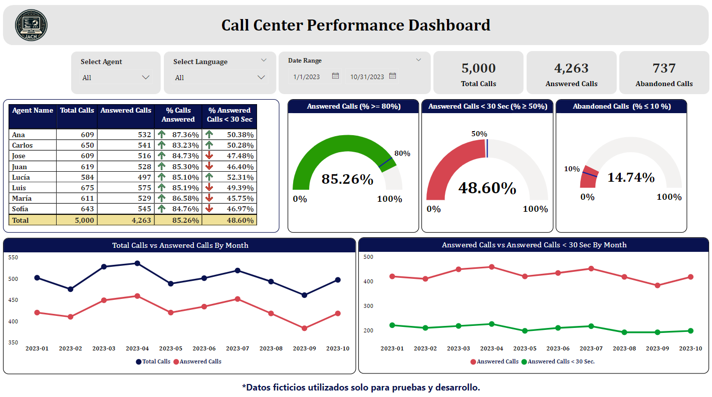

# Call Center Performance Dashboard

Este repositorio contiene un dashboard interactivo desarrollado en Power BI que simula la funcionalidad de un call center de un plan médico, 
utilizando datos ficticios (dummy data) con fines de desarrollo y pruebas.

## Descripción del Proyecto
     El dashboard proporciona una visión general del desempeño del call center, permitiendo analizar indicadores clave como:

          - Total de llamadas atendidas y abandonadas.
          - Porcentaje de llamadas contestadas en menos de 30 segundos.
          - Porcentaje de llamadas abandonadas.
          - Comparaciones mensuales de:
               - Total de llamadas vs. llamadas contestadas.
               - Llamadas contestadas vs. llamadas contestadas en menos de 30 segundos.

## Características Principales:
          1. Filtros interactivos:
               - Filtrar datos por nombre del agente, idioma y rango de fechas.
          2. Indicadores clave (KPIs):
               - % de llamadas contestadas.
               - % de llamadas contestadas en menos de 30 segundos.
               - % de llamadas abandonadas.
          3. Visualizaciones gráficas:
               - Tendencias mensuales del desempeño del call center.
          4. Tablas dinámicas con métricas detalladas por agente.

## Objetivo
          Este proyecto tiene como objetivo mostrar habilidades en el desarrollo de visualizaciones de datos con Power BI 
          y demostrar cómo estos análisis pueden ayudar en la optimización de recursos y la mejora de la experiencia del 
          cliente en un entorno de atención médica.  

## Captura del Dashboard

## Uso 
          1. Requisitos previos:
               - Tener instalado Power BI Desktop.
          2. Abrir el archivo:
               - Descarga y abre el archivo .pbix en Power BI.
          3. Explorar los datos:
               - Usa los filtros y visualizaciones para analizar los datos ficticios.

## Tecnologías Utilizadas
          - Power BI: Para el diseño del dashboard y la visualización de datos.
          - Datos ficticios: Simulan las operaciones reales de un call center.              

## Notas
     - Este proyecto es únicamente para fines educativos y de demostración. Todos los datos presentados son ficticios y no 
       representan datos reales.
