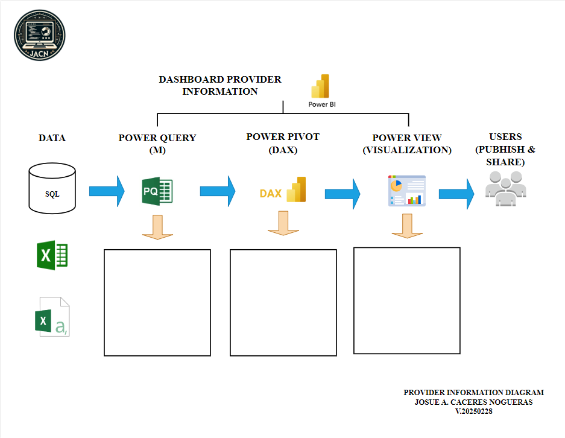

# Dashboard Provider Information

## Descripción del Proyecto
     Este proyecto tiene como objetivo medir y analizar la distribución de proveedores de salud en Puerto Rico 
     según su especialidad y edad. A través de este análisis, buscamos obtener una visión integral del panorama 
     de los proveedores de salud en la isla, identificando posibles brechas y oportunidades de mejora.

     Los datos obtenidos permitirán diseñar estrategias más efectivas para optimizar la oferta de servicios de salud,
     garantizar una mejor distribución de especialistas y fomentar políticas que fortalezcan el sistema de salud en 
     Puerto Rico. Con esta información, se podrán tomar decisiones informadas para mejorar el acceso y la calidad de 
     los servicios médicos en la población.

## Características Principales:

## Objetivo

## Captura del Diagrama

## Captura del Dashboard

## Uso 
          1. Requisitos previos:
               - Tener instalado Power BI Desktop.
          2. Abrir el archivo:
               - Descarga y abre el archivo .pbix en Power BI.
          3. Explorar los datos:
               - Usa los filtros y visualizaciones para analizar los datos ficticios.

## Tecnologías Utilizadas
          - Power BI: Para el diseño del dashboard y la visualización de datos.
          - Datos ficticios: Simulan las operaciones reales de un call center.              

## Notas
     - Este proyecto es únicamente para fines educativos y de demostración.